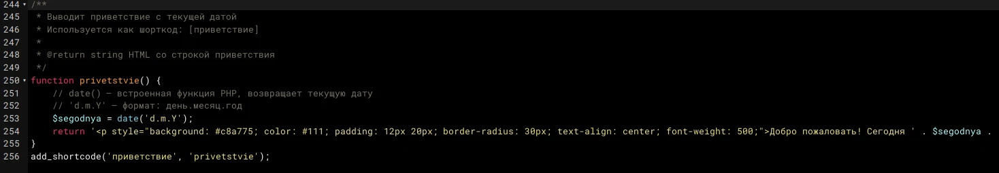
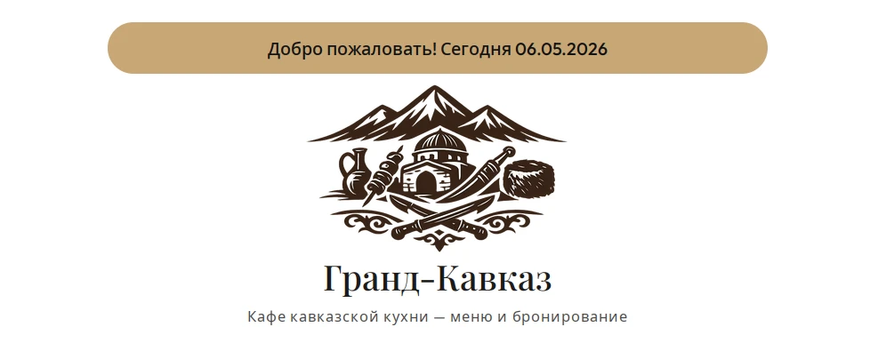

# CODE_REVIEW — инспекция кода

**Дата проверки:** 06.05.2026  
**Файл:** functions.php  
**Проект:** Гранд-Кавказ — Кафе кавказской кухни  
**Тема:** Food Blog FSE / Fresh Blog Lite

---

## 📸 Доказательства проверки

### 1. Код функции `privetstvie()` с PHPDoc и комментариями



### 2. Работа шорткода `[приветствие]` на главной странице



---

## ✅ Что проверяли

- [x] Наличие PHPDoc-комментариев перед функцией
- [x] Наличие строчных комментариев (`//`) внутри функции
- [x] Точки с запятой в конце строк
- [x] Синтаксическая корректность (сайт не падает)
- [x] Работоспособность шорткода `[приветствие]` на главной странице

---

## 🔍 Результаты проверки

| Проверка | Статус | Примечание |
|----------|--------|------------|
| PHPDoc-комментарий (`/** ... */`) | ✅ пройдено | Есть описание функции, `@return string` |
| Строчные комментарии (`//`) | ✅ пройдено | Пояснения к `date()` и формату даты |
| Точки с запятой | ✅ пройдено | Все строки корректно завершены |
| Синтаксис | ✅ пройдено | Ошибок нет, сайт работает |
| Шорткод `[приветствие]` | ✅ пройдено | Отображается на главной странице |

---

## 📝 Проверенный код

```php
/**
 * Выводит приветствие с текущей датой
 * Используется как шорткод: [приветствие]
 *
 * @return string HTML со строкой приветствия
 */
function privetstvie() {
    // date() — встроенная функция PHP, возвращает текущую дату
    // 'd.m.Y' — формат: день.месяц.год
    $segodnya = date('d.m.Y');
    return '<p style="background: #c8a775; color: #111; padding: 12px 20px; border-radius: 30px; text-align: center; font-weight: 500;">Добро пожаловать! Сегодня ' . $segodnya . '</p>';
}
add_shortcode('приветствие', 'privetstvie');
