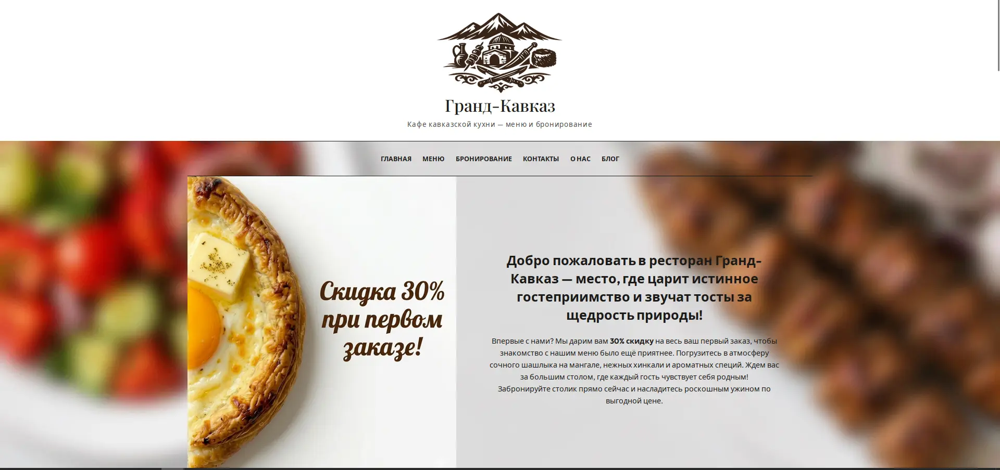
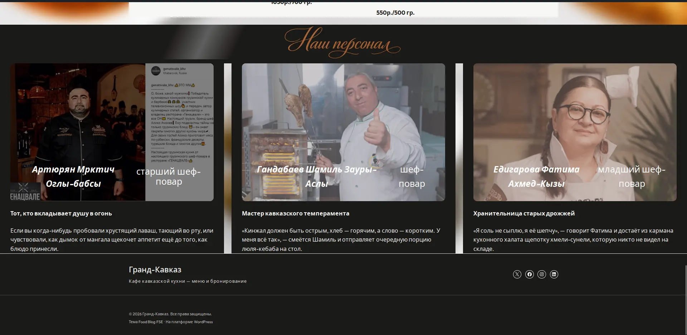
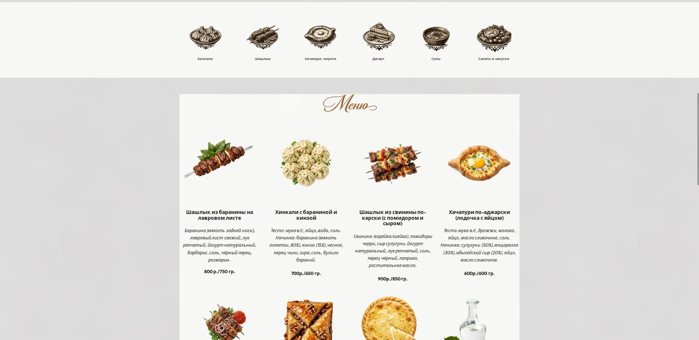
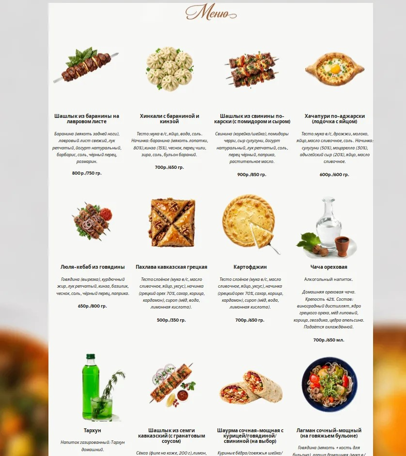
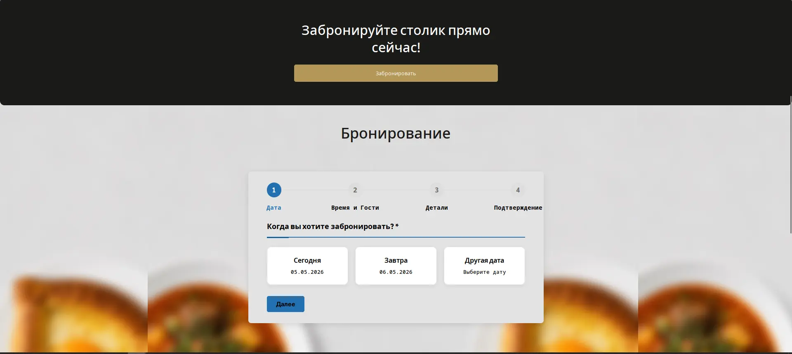
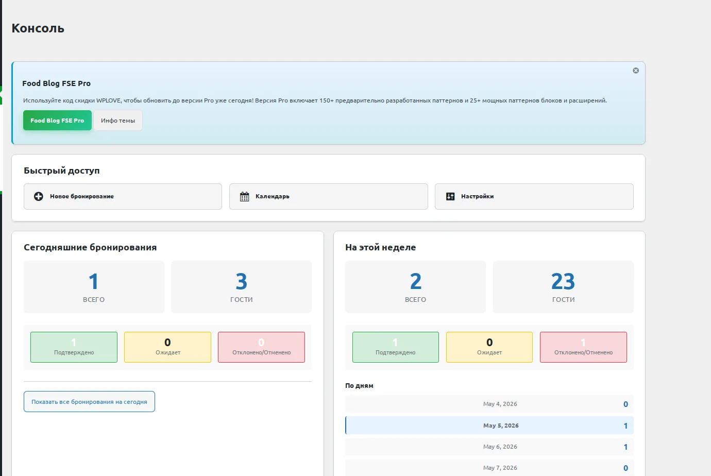
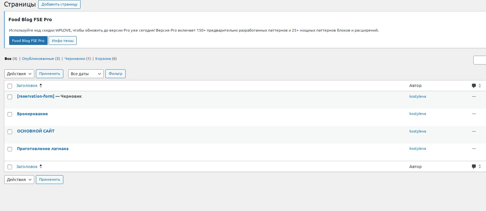

# 🍽️ Гранд-Кавказ — Кафе кавказской кухни

> Проект по учебной практике (ПМ.02, день 1-4)  
> **Специальность:** 09.02.07 Информационные системы и программирование  
> **Тема сайта:** Кафе кавказской кухни — меню и бронирование столиков

---

## 📌 О проекте

«Гранд-Кавказ» — это сайт для кафе кавказской кухни, где посетители могут:
- ознакомиться с меню (грузинская, армянская, осетинская, адыгейская кухни)
- забронировать столик онлайн
- почитать блог о кавказских традициях
- узнать контакты и часы работы

---

## 🚀 Технологии

| Технология | Назначение |
|------------|------------|
| LAMP (Linux, Apache, MySQL, PHP) | Серверная платформа |
| WordPress | Система управления контентом |
| GitHub | Хранение кода и документации |
| Contact Form 7 | Форма бронирования столиков |

---

## 📸 Скриншоты проекта

### 🏠 Главная страница

---

### 🧑‍🍳 Наши шеф-повара

---

### 📋 Категории блюд и меню

---

### 🍽️ Меню

---

### 📅 Бронирование столика

---

### 📞 Отображение заявок в консоли

---

### 📑 Страницы сайта

---

## 📁 Структура репозитория

| Файл | Описание |
|------|----------|
| `README.md` | Описание проекта (этот файл) |
| `Главная_страница.jpeg` | Скриншот главной страницы |
| `Меню.jpg` | Скриншот страницы меню |
| `Категории_блюд_и_меню.jpeg` | Категории блюд |
| `Бронирование.jpeg` | Форма бронирования |
| `Отображение_заявок_в_консоли.jpeg` | Заявки в админке |
| `Страницы.jpeg` | Список страниц сайта |
| `Наши_шеф-повары.jpeg` | Информация о шеф-поварах |

---

## 👩‍💻 Авторы

| ФИО | Группа |
|-----|--------|
| Костылева | ИС-21 |
| Зозуля | ИС-21 |

**Усть-Лабинский социально-педагогический колледж**  
**Руководитель:** Граков Дмитрий Витальевич

---

## 🔗 Ссылка на сайт

> [http://10.40.40.186](http://10.40.40.186) — действующий сайт (доступен в локальной сети)

---

© 2026 Гранд-Кавказ. Все права защищены.
