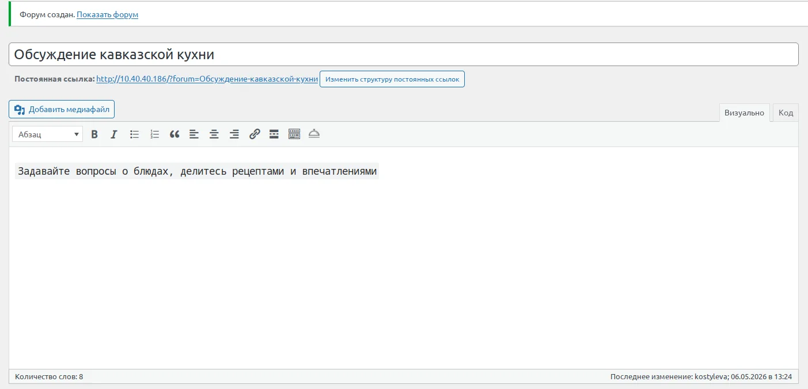
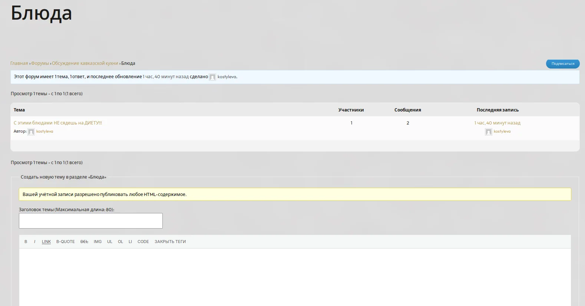
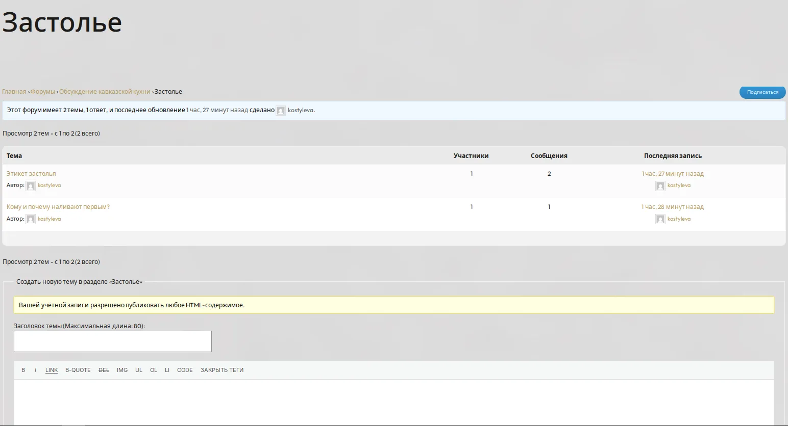
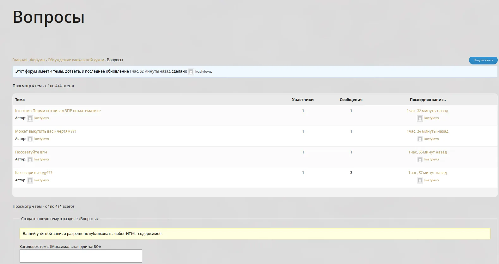
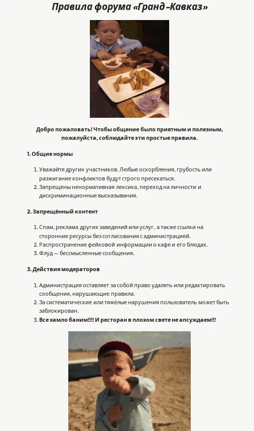

# 🍽️ Гранд-Кавказ — Кафе кавказской кухни

> Проект по учебной практике (ПМ.02)  
> **Специальность:** 09.02.07 Информационные системы и программирование  
> **Тема сайта:** Кафе кавказской кухни — меню и бронирование столиков

---

## 📌 О проекте

«Гранд-Кавказ» — это сайт для кафе кавказской кухни, где посетители могут:
- ознакомиться с меню (грузинская, армянская, осетинская, адыгейская кухни)
- забронировать столик онлайн
- почитать блог о кавказских традициях
- узнать контакты и часы работы
- **общаться на форуме**

---

## 🚀 Технологии

| Технология | Назначение |
|------------|------------|
| LAMP (Linux, Apache, MySQL, PHP) | Серверная платформа |
| WordPress | Система управления контентом |
| GitHub | Хранение кода и документации |
| Contact Form 7 | Форма бронирования столиков |
| bbPress | Форум для общения посетителей |

---

## 📢 Форум

На сайте установлен форум **bbPress** для общения посетителей.

### 📊 Статистика форума

| Показатель | Значение |
|------------|----------|
| Форумов | 1 |
| Категорий | 3 (Блюда, Застолье, Вопросы) |
| Тем | 3+ |
| Сообщений | 3+ |

### 🏷️ Категории форума

| Категория | Описание |
|-----------|----------|
| 🍽️ **Блюда** | Обсуждение рецептов, вкусов и секретов приготовления |
| 🍷 **Застолье** | Тосты, традиции, юмор и всё, что за столом |
| ❓ **Вопросы** | Вопросы о меню, бронировании и работе кафе |

### 📜 Правила форума

📚 [Правила форума «Гранд-Кавказ»](http://10.40.40.186/pravila-foruma)

---

## 📸 Скриншоты

### Установка и создание форума

| Установка плагина | Созданный форум |
|------------------|-----------------|
|  |  |

### Категории форума

| Блюда | Застолье | Вопросы |
|-------|----------|---------|
|  |  |  |

### Правила форума

---

## 🔗 Ссылки

| Что | Ссылка |
|-----|--------|
| **Сайт** | [http://10.40.40.186](http://10.40.40.186) |
| **Форум** | [http://10.40.40.186/forums](http://10.40.40.186/forums) |
| **Правила форума** | [http://10.40.40.186/pravila-foruma](http://10.40.40.186/pravila-foruma) |

---

## 👩‍💻 Авторы

| ФИО | Группа |
|-----|--------|
| Костылева | ИС-21 |
| Зозуля | ИС-21 |

**Усть-Лабинский социально-педагогический колледж**  
**Руководитель:** Граков Дмитрий Витальевич

---

## ✅ Результаты тестирования

📄 [Файл TESTING.md](TESTING.md) — содержит результаты тестирования форума.

---

© 2026 Гранд-Кавказ. Все права защищены.
